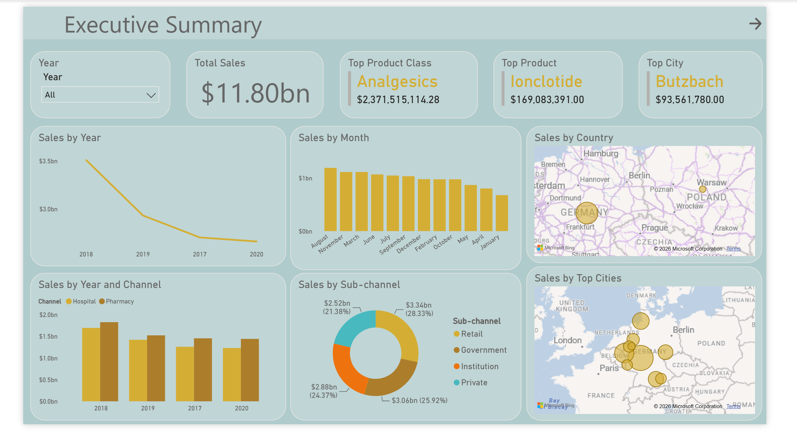

# 💊 Pharmaceutical Sales Analysis Dashboard


---

# 📌 Project Overview

The Pharmaceutical Sales Analysis Dashboard is an end-to-end data analytics project developed to analyze pharmaceutical sales data and generate actionable business insights.

The project uses **Python (Pandas)** for data cleaning, preprocessing, and exploratory analysis, while **Power BI** is used to build an interactive dashboard for monitoring sales performance across products, distributors, customers, channels, and geographic regions.

---

# 🎯 Business Objectives

- Analyze overall pharmaceutical sales performance.
- Identify top-performing products and product classes.
- Evaluate distributor and customer performance.
- Compare sales across different channels and sub-channels.
- Analyze country and city-wise sales distribution.
- Provide interactive dashboards for business decision-making.

---

# 🛠️ Tech Stack

| Tool | Purpose |
|-------|----------|
| Python | Data Cleaning & Analysis |
| Pandas | Data Manipulation |
| Jupyter Notebook | Data Exploration |
| Power BI | Dashboard Development |

---

# 📂 Repository Structure

```
Pharmaceutical-Sales-Analysis-Dashboard
│
├── data
│   └── pharma-data.csv.zip
│
├── notebook
│   └── data-exploration.ipynb
│
├── power bi
│   └── pharmaceutical_sales_analysis.pbix
│
├── images
│   ├── executive_summary.png
│   └── distributor_customer_analysis.png
│
├── README.md
└── LICENSE
```

---

# 📊 Dataset

The dataset contains pharmaceutical sales transactions from **2017–2020** and includes information such as:

- Distributor
- Customer
- Product Name
- Product Class
- Channel
- Sub-channel
- Country
- City
- Sales Team
- Sales Manager
- Sales Representative
- Month
- Year
- Sales Amount

---

# 🧹 Data Preparation

Data preprocessing was performed using **Pandas**.

The following tasks were completed:

- Imported and inspected the dataset
- Checked data types
- Identified missing values
- Removed duplicate records
- Validated data consistency
- Prepared the dataset for Power BI

---

# 📈 Dashboard 1 — Executive Summary

This dashboard provides an overview of overall business performance.

### Highlights

- Year Filter
- Total Sales KPI
- Top Product Class
- Top Product
- Top City
- Sales by Year
- Sales by Month
- Sales by Country
- Sales by Channel
- Sales by Sub-channel
- Sales by Top Cities

### Dashboard Preview



---

# 📈 Dashboard 2 — Distributor & Sales Team Analysis

This dashboard focuses on distributor and customer performance.

### Highlights

- Top Distributors
- Top Customers
- Sales by Distributor
- Sales by Product
- Sales by Channel
- Sales by Sub-channel
- Distributor Sales Matrix
- Geographic Distribution of Customers

### Dashboard Preview


---

# 💡 Key Insights

- Total sales exceeded **$11.80 Billion**.
- Analgesics was the highest-selling product class.
- Ionclotide generated the highest product revenue.
- Butzbach recorded the highest city-wise sales.
- Gerlach LLC was the top-performing distributor.
- Germany contributed the majority of overall sales.
- Retail accounted for the largest share among sub-channels.
- Hospital and Pharmacy were the primary sales channels.

---

# 📚 Skills Demonstrated

- Data Cleaning
- Data Validation
- Data Preparation
- Exploratory Data Analysis
- Power BI Dashboard Development
- Data Modeling
- DAX Measures
- Business Intelligence
- KPI Reporting
- Business Insight Generation

---

# 🚀 Future Improvements

- Add sales forecasting.
- Integrate real-time data sources.
- Include profitability analysis.
- Build customer segmentation dashboards.

---

# ▶️ Getting Started

### Clone the Repository

```bash
git clone https://github.com/VanshdeepSharma2005/Pharmaceutical-Sales-Analysis-Dashboard.git
```

### Install Dependencies

```bash
pip install pandas
```

### Open the Notebook

```
notebook/data-exploration.ipynb
```

### Open the Dashboard

```
power bi/pharmaceutical_sales_analysis.pbix
```

using **Power BI Desktop**.

---

# 👨‍💻 Author

**Vanshdeep Sharma**

- GitHub: https://github.com/VanshdeepSharma2005

---

⭐ If you found this project useful, consider giving it a star!
